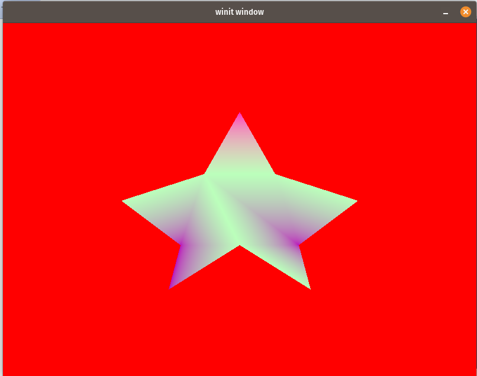

## What is a buffer?
- data stored <ins>sequentially</ins> in memory.
### Vertex buffer
- storage for vertex data
```rust,noplayground
// lib.rs
#[repr(C)]
#[derive(Copy, Clone, Debug)]
struct Vertex {
    position: [f32; 3],
    color: [f32; 3],
}
```
- implement `Copy`
### What to do with it?
- `VertexBufferLayou` defines how a buffer is represented in memory.
```rust,noplayground
pub fn desc() -> wgpu::VertexBufferLayout<'static> {
    use std::mem;
    wgpu::VertexBufferLayout {
        array_stride: mem::size_of::<Self>() as wgpu::BufferAddress,
        step_mode: wgpu::VertexStepMode::Vertex,
        // attributes: &[
        //     wgpu::VertexAttribute {
        //         offset: 0,
        //         shader_location: 0,
        //         format: wgpu::VertexFormat::Float32x3,
        //     },
        //     wgpu::VertexAttribute {
        //         offset: std::mem::size_of::<[f32; 3]>() as wgpu::BufferAddress,
        //         shader_location: 1,
        //         format: wgpu::VertexFormat::Float32x2,
        //     },
        // ],
        attributes: &Self::ATTRIBS,
    }
}
```
- `array_stride`: how wide vertex is
- `step_mode`: tells pipeline whether each element of array in this buffer represents per vertex data or per-instance data
- `attributes`: 
    - `offset`: offset in bytes until the attribute starts. First attribute usually at 0. For any later attributes, te offset is the sum over `size_of` the previous attributes' data.
    - `shader_location`: for example 

| variable | definition |    
|-|-|
|`@location(0) x: vec3<f32>` | `position` field of Vertex struct |
|`@location(1) x: vec3<f32>` | `color` field |

- `format` shape of the attribute. `Float32x4` -> correspond to `vec3<f32>` in shader code. 

### Index buffer

- Vertex made off triangle
```rust,noplayground
const VERTICES: &[Vertex] = &[
    Vertex { position: [-0.0868241, 0.49240386, 0.0], color: [0.5, 0.0, 0.5] }, // A
    Vertex { position: [-0.49513406, 0.06958647, 0.0], color: [0.5, 0.0, 0.5] }, // B
    Vertex { position: [0.44147372, 0.2347359, 0.0], color: [0.5, 0.0, 0.5] }, // E

    Vertex { position: [-0.49513406, 0.06958647, 0.0], color: [0.5, 0.0, 0.5] }, // B
    Vertex { position: [-0.21918549, -0.44939706, 0.0], color: [0.5, 0.0, 0.5] }, // C
    Vertex { position: [0.44147372, 0.2347359, 0.0], color: [0.5, 0.0, 0.5] }, // E

    Vertex { position: [-0.21918549, -0.44939706, 0.0], color: [0.5, 0.0, 0.5] }, // C
    Vertex { position: [0.35966998, -0.3473291, 0.0], color: [0.5, 0.0, 0.5] }, // D
    Vertex { position: [0.44147372, 0.2347359, 0.0], color: [0.5, 0.0, 0.5] }, // E
];
```
- C, and B get used twice, and E is repeated 3 times -> the need for vertex buffer
```rust,noplayground
// lib.rs
const VERTICES: &[Vertex] = &[
    Vertex { position: [-0.0868241, 0.49240386, 0.0], color: [0.5, 0.0, 0.5] }, // A
    Vertex { position: [-0.49513406, 0.06958647, 0.0], color: [0.5, 0.0, 0.5] }, // B
    Vertex { position: [-0.21918549, -0.44939706, 0.0], color: [0.5, 0.0, 0.5] }, // C
    Vertex { position: [0.35966998, -0.3473291, 0.0], color: [0.5, 0.0, 0.5] }, // D
    Vertex { position: [0.44147372, 0.2347359, 0.0], color: [0.5, 0.0, 0.5] }, // E
];

const INDICES: &[u16] = &[
    0, 1, 4,
    1, 2, 4,
    2, 3, 4,
];
```
- `VERTICES` (30 elements)-> 120 bytes.
- `u16` is 2 bytes wide. `INDICES` -> 18 bytes (18 can't devide by 4) -> `wgpu` automatically adds 2 extra bytes to buffer -> 20 bytes ( 20 now can devide by 4)
- Example: triangle -> vertex[0] , vertex[1], vertex[4] -> A, B, E
- You can only have one index buffer set at a time.
- When use index buffer, need to use `draw_indexed` function

### Color Correction

- Hex value: `#BC00BC` -> convert RGB: `(188, 0 , 188)` -> divide by 255 -> `(0.737254902, 0, 0.737254902)` -> not the same as our vertex colors which is `(0.5, 0.0, 0.5)`
- Most monitor use sRGB (depend on what is returned from `surface.get_preferred_format()` using sRGB texture format)
- to get correct color: `srgb_color = ((rgb_color / 255 + 0.055) / 1.055 ) ^ 2.4`
- vertices and indices for a star shape (notes: triangle formed by vertices <ins>counter-clockwise</ins>):
```rust,noplayground
#[rustfmt::skip]
const VERTICES_STAR: &[Vertex] = &[
    Vertex { position: [0.0, 0.5, 0.0], color: [1.0, 0.0, 0.5] }, // A
    Vertex { position: [0.15, 0.15, 0.0], color: [0.5, 1.0, 0.5] }, // B
    Vertex { position: [0.5, 0.0, 0.0], color: [0.5, 1.0, 0.5] }, // C
    Vertex { position: [0.25, -0.25, 0.0], color: [0.5, 0.0, 0.5] }, // D
    Vertex { position: [0.3, -0.5, 0.0], color: [0.5, 1.0, 0.5] }, // E
    Vertex { position: [0.0, -0.25, 0.0], color: [0.5, 1.0, 0.5] }, // F
    Vertex { position: [-0.3, -0.5, 0.0], color: [0.5, 0.0, 0.5] }, // G
    Vertex { position: [-0.25, -0.25, 0.0], color: [0.5, 0.0, 0.5] }, // H
    Vertex { position: [-0.5, 0.0, 0.0], color: [0.5, 1.0, 0.5] }, // I
    Vertex { position: [-0.15, 0.15, 0.0], color: [0.5, 1.0, 0.5] }, // J
];

#[rustfmt::skip]
const INDICES_STAR: &[u16] = &[
    0, 9, 1,
    1, 3, 2,
    3, 5, 4,
    7, 6, 5,
    9, 8, 7,
    1, 9, 3,
    9, 5, 3,
    9, 7, 5,
];
```


