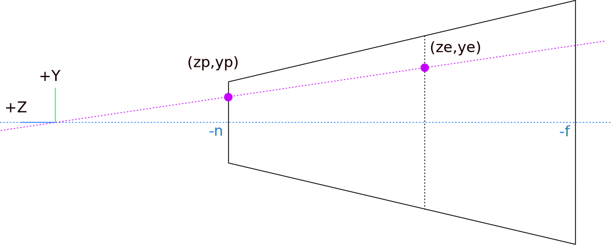
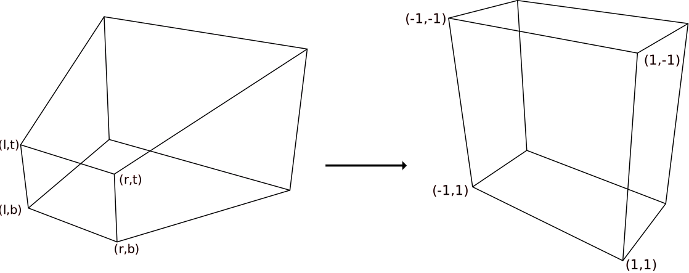

# Camera

## The perspective projection matrix

### Projecting onto the near plane

The frustum is a pyramid with the camera as its apex:

<strong>Vulkan:</strong>
$$ \\frac{x_p}{x_e} = \\frac{y_p}{y_e} = \\frac{z_p}{z_e} = \\frac{-n}{z_e}  $$
<strong>WebGPU:</strong>
$$ \\frac{x_p}{x_e} = \\frac{y_p}{y_e} = \\frac{z_p}{z_e} = \\frac{n}{z_e}  $$
\\(z_p\\) will always be \\(-n\\) because we are projecting points on the near plane.  

<strong>Vulkan:</strong>
\\\[x_p = \\frac{-nx_e}{z_e} = \\frac{1}{-z_e}nx_e \\\\
y_p = \\frac{-ny_e}{z_e} = \\frac{1}{-z_e}ny_e \\\\
z_p = -n = \\frac{1}{-z_e}nz_e \\\]
<strong>WebGPU:</strong>
\\\[x_p = \\frac{nx_e}{z_e} = \\frac{1}{z_e}nx_e \\\\
y_p = \\frac{ny_e}{z_e} = \\frac{1}{z_e}ny_e \\\\
z_p = n = \\frac{1}{z_e}nz_e \\\]
\\(x_p\\) and \\(y_p\\) are inversely proportional to \\(z_e\\). But the result of
multiplication between a matrix and a vector is a linear combination of its components,
it's not possible to divide by a component. To solve this, the hardware performs what's called a "perspective divide".
Every components of the clip coordinate gets divided by its 4th component (\\(w_c\\)),
so we will set it to \\(-z_e\\) (\\(z_e\\) in WebGPU) to divide \\(x_p\\), \\(y_p\\) and \\(z_p\\)

We just derived \\(w_c\\) so we can fill one row in our projection matrix  

<strong>Vulkan:</strong>
$$ w_c = -1 \\times z_e $$
\\\[ \\begin{pmatrix}
. & . & . & .\\\\
. & . & . & .\\\\
. & . & . & .\\\\
0 & 0 & -1 & 0
\\end{pmatrix}
\\begin{pmatrix}
x_e \\\\
y_e \\\\
z_e \\\\
1
\\end{pmatrix} =
\\begin{pmatrix}
x_c \\\\
y_c \\\\
z_c \\\\
w_c
\\end{pmatrix}
\\\]

<strong>WebGPU:</strong>
$$ w_c = 1 \\times z_e $$
\\\[ \\begin{pmatrix}
. & . & . & .\\\\
. & . & . & .\\\\
. & . & . & .\\\\
0 & 0 & 1 & 0
\\end{pmatrix}
\\begin{pmatrix}
x_e \\\\
y_e \\\\
z_e \\\\
1
\\end{pmatrix} =
\\begin{pmatrix}
x_c \\\\
y_c \\\\
z_c \\\\
w_c
\\end{pmatrix}
\\\]

### Going from near plane to near clip plane

The normalized device coordinates are the clip coordinates divided by their 4th component:
\\\[
\\begin{pmatrix}
x_n \\\\
yn \\\\
z_n \\\\
w_n
\\end{pmatrix} =
\\begin{pmatrix}
\\frac{x_c}{w_c} \\\\
\\frac{y_c}{w_c} \\\\
\\frac{z_c}{w_c} \\\\
\\frac{w_c}{w_c} \\\\
\\end{pmatrix}
\\\]

The near plane of our frustum is defined by 4 corners \\((l,t)\\), \\((r,t)\\), \\((r,b)\\), and \\((l,b)\\).
We want to match these with \\((-1,1)\\), \\((1, -1)\\), \\((1,1)\\) and \\((-1,1)\\) respectively.

he mapping of the near frustum plane to the near clip plane is a linear function of the form \\(f(x) = \\alpha x + \\beta\\). We can use the formula to find the slope of the function
and then, by replacing the known values in the function, we can find the constant term:

Starting with the x coordinate:
\\\[
\\begin{aligned}
& f(l) = -1 \\quad \\text{and} \\quad f( r) = 1\\\\
\\Rightarrow \\quad & \\alpha = \\frac{1 - (-1)}{r - l} = \\frac{2}{r-l} \\\\
\\\\
& f( r) = 1\\\\
\\Rightarrow \\quad & f( r) = 1 = \\frac{2}{r - l} r + \\beta \\\\
\\Leftrightarrow \\quad &\\beta = 1 - \\frac{2r}{r-l} =  -\\frac{r+l}{r-l}\\
\\\\
& f(x_p) = x_n\\\\
\\Leftrightarrow \\quad & x_n = \\frac{2}{r-l} x_p - \\frac{r+l}{r-l}
\\end{aligned}
\\\]

The same goes for finding y:  
<strong>Vulkan:</strong>
\\\[
\\begin{aligned}
& f(t) = -1 \\quad \\text{and} \\quad f(b) = 1 \\\\
\\Rightarrow \\quad & \\alpha = \\frac{1 - (-1)}{b - t} = \\frac{2}{b-t} \\\\
\\\\
& f(b) = 1\\\\
\\Rightarrow \\quad     & f(b) = 1 = \\frac{2}{b - t} b + \\beta \\\\
\\Leftrightarrow \\quad &\\beta = 1 - \\frac{2b}{b-t} = -\\frac{b+t}{b-t}\\\\
\\\\
& f(y_p) = y_n\\\\
\\Leftrightarrow \\quad & y_n = \\frac{2}{b-t} y_p - \\frac{b+t}{b-t}
\\end{aligned}
\\\]

<strong>WebGPU:</strong>
\\\[
\\begin{aligned}
& f(b) = -1 \\quad \\text{and} \\quad f(t) = 1 \\\\
\\Rightarrow \\quad & \\alpha = \\frac{1 - (-1)}{t - b} = \\frac{2}{t-b} \\\\
\\\\
& f(t) = 1\\\\
\\Rightarrow \\quad     & f(t) = 1 = \\frac{2}{t - b} t + \\beta \\\\
\\Leftrightarrow \\quad &\\beta = 1 - \\frac{2t}{t-b} = -\\frac{b+t}{t-b}\\\\
\\\\
& f(y_p) = y_n\\\\
\\Leftrightarrow \\quad & y_n = \\frac{2}{t-b} y_p - \\frac{b+t}{t-b}
\\end{aligned}
\\\]
Now we just have to replace \\(x_p\\) and \\(y_p\\) by the expressions we found earlier in terms of \\(x_e\\) and \\(y_e\\).  

<strong>Vulkan:</strong>
\\\[
\\begin{aligned}
x_n &= \\frac{2}{r-l} x_p - \\frac{r+l}{r-l}\\\\
&= \\frac{2}{r-l} \\left(\\frac{1}{-z_e} n x_e\\right) - \\frac{r+l}{r-l}\\\\
&= \\frac{1}{-z_e} \\left( \\frac{2n}{r-l} x_e + \\frac{r+l}{r-l} z_e \\right)\\\\
\\\\
y_n &= \\frac{2}{b-t} y_p - \\frac{b+t}{b-t}\\\\
&= \\frac{2}{b-t} \\left(\\frac{1}{-z_e} n y_e\\right) - \\frac{b+t}{b-t}\\\\
&= \\frac{1}{-z_e} \\left( \\frac{2n}{b-t} y_e + \\frac{b+t}{b-t} z_e \\right)
\\end{aligned}
\\\]
<strong>WebGPU:</strong>
\\\[
\\begin{aligned}
x_n &= \\frac{2}{r-l} x_p - \\frac{r+l}{r-l}\\\\
&= \\frac{2}{r-l} \\left(\\frac{1}{z_e} n x_e\\right) - \\frac{r+l}{r-l}\\\\
&= \\frac{1}{z_e} \\left( \\frac{2n}{r-l} x_e - \\frac{r+l}{r-l} z_e \\right)\\\\
\\\\
y_n &= \\frac{2}{t-b} y_p - \\frac{b+t}{t-b}\\\\
&= \\frac{2}{t-b} \\left(\\frac{1}{z_e} n y_e\\right) - \\frac{b+t}{t-b}\\\\
&= \\frac{1}{z_e} \\left( \\frac{2n}{t-b} y_e - \\frac{b+t}{t-b} z_e \\right)
\\end{aligned}
\\\]

Remember that \\( x_n = \\frac{x_c}{w_c} \\) and \\( y_n = \\frac{y_c}{w_c} \\). By factoring by \\( \\frac{1}{-z_e} \\) (\\( \\frac{1}{z_e} \\) in WebGPU).
We now have:  

<strong>Vulkan:</strong>
\\\[
\\begin{equation}
\\begin{pmatrix}
\\frac{2n}{r-l} & 0 & \\frac{r+l}{r-l} & 0\\\\
0 & \\frac{2n}{b-t} & \\frac{b+t}{b-t} & 0\\\\
. & . & . & .\\\\
0 & 0 & -1 & 0
\\end{pmatrix}
\\begin{pmatrix}
x_e \\\\
y_e \\\\
z_e \\\\
1
\\end{pmatrix}=
\\begin{pmatrix}
x_c \\\\
y_c \\\\
z_c \\\\
w_c
\\end{pmatrix}
\\end{equation}
\\\]

<strong>WebGPU:</strong>
\\\[
\\begin{equation}
\\begin{pmatrix}
\\frac{2n}{r-l} & 0 & -\\frac{r+l}{r-l} & 0\\\\
0 & \\frac{2n}{t-b} & -\\frac{b+t}{t-b} & 0\\\\
. & . & . & .\\\\
0 & 0 & 1 & 0
\\end{pmatrix}
\\begin{pmatrix}
x_e \\\\
y_e \\\\
z_e \\\\
1
\\end{pmatrix}=
\\begin{pmatrix}
x_c \\\\
y_c \\\\
z_c \\\\
w_c
\\end{pmatrix}
\\end{equation}
\\\]

### Deriving the depth projection

Unfortunately, we cannot use the same method to find the coefficients for z,
because z will always be on the near plane after projecting a point onto the near plane.
We know that the z coordinate does not depend on \\(x\\) and \\(y\\),
so let's fill the remaining row with 0 for x and y, and
A and B for the coefficients we need to find.  

<strong>Vulkan:</strong>
\\\[
\\begin{equation}
\\begin{pmatrix}
\\frac{2n}{r-l} & 0 & \\frac{r+l}{r-l} & 0\\\\
0 & \\frac{2n}{t-b} & \\frac{b+t}{t-b} & 0\\\\
0 & 0 & A & B\\\\
0 & 0 & -1 & 0
\\end{pmatrix}
\\begin{pmatrix}
x_e \\\\
y_e \\\\
z_e \\\\
1
\\end{pmatrix}=
\\begin{pmatrix}
x_c \\\\
y_c \\\\
z_c \\\\
w_c
\\end{pmatrix}
\\end{equation}
\\\]

<strong>WebGPU:</strong>
\\\[
\\begin{equation}
\\begin{pmatrix}
\\frac{2n}{r-l} & 0 & -\\frac{r+l}{r-l} & 0\\\\
0 & \\frac{2n}{t-b} & -\\frac{b+t}{t-b} & 0\\\\
0 & 0 & A & B\\\\
0 & 0 & 1 & 0
\\end{pmatrix}
\\begin{pmatrix}
x_e \\\\
y_e \\\\
z_e \\\\
1
\\end{pmatrix}=
\\begin{pmatrix}
x_c \\\\
y_c \\\\
z_c \\\\
w_c
\\end{pmatrix}
\\end{equation}
\\\]

By definition \\(z_n\\) is:  
<strong>Vulkan:</strong>
\\\[
z_n = \\frac{z_c}{w_c} = \\frac{A \\times z_e + B \\times w_e}{-z_e}
\\\]
<strong>WebGPU:</strong>
\\\[
z_n = \\frac{z_c}{w_c} = \\frac{A \\times z_e + B \\times w_e}{z_e}
\\\]

\\(w_e\\) is always going to be 1.  
<strong>Vulkan:</strong>
\\\[
z_n = \\frac{z_c}{w_c} = \\frac{A \\times z_e + B}{-z_e}
\\\]
<strong>WebGPU:</strong>
\\\[
z_n = \\frac{z_c}{w_c} = \\frac{A \\times z_e + B}{z_e}
\\\]

To find A and B, we will replace \\(z_n\\) and \\(z_e\\)
with known values: the near plane maps to \\(1\\)
in NDC and the far plane maps to \\(0\\)

<strong>Note:</strong> The setup shown here is using \\(1\\)
for the near plane and \\(0\\)
for the far plane. It is called “Reverse Depth” and results in
a better distribution of the floating points values than using
\\(-1\\) and \\(1\\) or \\(0\\) and \\(1\\)

The default DirectX convention is to use \\(0\\)
for near plane and \\(1\\) for far plane, legacy OpenGL uses \\(-1\\)
for near and \\(1\\) for far (this is the worst for floating point precision).  
<strong>Vulkan:</strong>
\\\[
z_n = 1 \\Rightarrow z_e = -n\\\\
z_n = 0 \\Rightarrow z_e = -f\\\\
\\\\
\\begin{array}{lr}
\\frac{A \\times \\left(-n\\right) + B}{-(-n)} = 1\\\\
\\frac{A \\times \\left(-f\\right) + B}{-(-f)} = 0
\\end{array}
\\\\
\\Leftrightarrow
\\quad
\\begin{array}{lr}
A \\times (-n) + B = n\\\\
A \\times (-f) + B = 0
\\end{array}
\\\\
\\Leftrightarrow
\\quad
\\begin{array}{lr}
A \\times (-n) + Af = n\\\\
B = A f
\\end{array}
\\\\
\\Leftrightarrow
\\quad
\\begin{array}{lr}
A = \\frac{n}{f-n}\\\\
B = \\frac{nf}{f-n}
\\end{array}
\\\]

<strong>WebGPU:</strong>
\\\[
z_n = 0 \\Rightarrow z_e = n\\\\
z_n = 1 \\Rightarrow z_e = f\\\\
\\\\
\\begin{array}{lr}
\\frac{A \\times \\left(n\\right) + B}{n} = 0\\\\
\\frac{A \\times \\left(f\\right) + B}{f} = 1
\\end{array}
\\\\
\\Leftrightarrow
\\quad
\\begin{array}{lr}
A \\times (n) + B = 0\\\\
A \\times (f) + B = f
\\end{array}
\\\\
\\Leftrightarrow
\\quad
\\begin{array}{lr}
Af - An = f\\\\
B = -An
\\end{array}
\\\\
\\Leftrightarrow
\\quad
\\begin{array}{lr}
A = \\frac{f}{f-n}\\\\
B = \\frac{-nf}{f-n}
\\end{array}
\\\]

Here is our final expression for \\(z_n\\):  
<strong>Vulkan:</strong>
\\\[
z_n = \\frac{1}{-z_e} \\left({\\frac{n}{f-n} \\times z_e + \\frac{nf}{f-n}}\\right)
\\\]

<strong>WebGPU:</strong>
\\\[
z_n = \\frac{1}{z_e} \\left({\\frac{f}{f-n} \\times z_e + \\frac{-nf}{f-n}}\\right)
\\\]

Our matrix is now complete!  
<strong>Vulkan:</strong>
\\\[
\\begin{equation}
\\begin{pmatrix}
\\frac{2n}{r-l} & 0 & \\frac{r+l}{r-l} & 0\\\\
0 & \\frac{2n}{b-t} & \\frac{b+t}{b-t} & 0\\\\
0 & 0 & \\frac{n}{f-n} & \\frac{nf}{f-n}\\\\
0 & 0 & -1 & 0
\\end{pmatrix}
\\begin{pmatrix}
x_e \\\\
y_e \\\\
z_e \\\\
1
\\end{pmatrix}=
\\begin{pmatrix}
x_c \\\\
y_c \\\\
z_c \\\\
w_c
\\end{pmatrix}
\\end{equation}
\\\]

<strong>WebGPU:</strong>
\\\[
\\begin{equation}
\\begin{pmatrix}
\\frac{2n}{r-l} & 0 & -\\frac{r+l}{r-l} & 0\\\\
0 & \\frac{2n}{t-b} & -\\frac{b+t}{t-b} & 0\\\\
0 & 0 & \\frac{f}{f-n} & -\\frac{nf}{f-n}\\\\
0 & 0 & 1 & 0
\\end{pmatrix}
\\begin{pmatrix}
x_e \\\\
y_e \\\\
z_e \\\\
1
\\end{pmatrix}=
\\begin{pmatrix}
x_c \\\\
y_c \\\\
z_c \\\\
w_c
\\end{pmatrix}
\\end{equation}
\\\]

### Simplifying the matrix for the usual case

Most of the time we are working with symmetric frustum, that is \\(l = -r\\) and \\(b = -t\\)

The matrix becomes a bit simpler:
\\\[
\\begin{aligned}
& l = -r \\Rightarrow l + r = 0 \\quad \\text{and} \\quad  r - l = 2r = width\\\\
& b = -t \\Rightarrow b + t = 0 \\quad \\text{and} \\quad  b - t = -2t = -height
\\end{aligned}
\\\]

<strong>Vulkan:</strong>
\\\[
\\begin{equation}
\\begin{pmatrix}
\\frac{2n}{width} & 0 & 0 & 0\\\\
0 & -\\frac{2n}{height} & 0 & 0\\\\
0 & 0 & \\frac{n}{f-n} & \\frac{nf}{f-n}\\\\
0 & 0 & -1 & 0
\\end{pmatrix}
\\begin{pmatrix}
x_e \\\\
y_e \\\\
z_e \\\\
1
\\end{pmatrix}=
\\begin{pmatrix}
x_c \\\\
y_c \\\\
z_c \\\\
w_c
\\end{pmatrix}
\\end{equation}\\\]

<strong>WebGPU:</strong>
\\\[
\\begin{equation}
\\begin{pmatrix}
\\frac{2n}{width} & 0 & 0 & 0\\\\
0 & \\frac{2n}{height} & 0 & 0\\\\
0 & 0 & \\frac{f}{f-n} & -\\frac{nf}{f-n}\\\\
0 & 0 & 1 & 0
\\end{pmatrix}
\\begin{pmatrix}
x_e \\\\
y_e \\\\
z_e \\\\
1
\\end{pmatrix}=
\\begin{pmatrix}
x_c \\\\
y_c \\\\
z_c \\\\
w_c
\\end{pmatrix}
\\end{equation}\\\]

It's also easier to reason on the field of view and aspect ratios rather than on the width 
and the height of the near plane, so let's replace them:

Note: In WebGPU, the Z axe is reversed and X point up (height direction)

Let's try to express \\( \frac{2n}{width} \\) and \\( \frac{-2n}{height}\\) in terms of field of view and aspect ratio. (\\( \frac{2n}{width} \\) and \\( \frac{2n}{height}\\) in WebGPU)

<strong>Vulkan:</strong>
\\[
\begin{aligned}
& \tan\left(\frac{fov_y}{2}\right) = \frac{\frac{height}{2}}{n} \\\\
\Leftrightarrow \quad & 2n \tan\left(\frac{fov_y}{2}\right) = height \\\\
\Leftrightarrow \quad & \frac{2n}{height} = \frac{1}{\tan\left(\frac{fov_y}{2}\right)}
\end{aligned}
\\]

<strong>WebGPU:</strong>
\\[
\begin{aligned}
& \tan\left(\frac{fov_y}{2}\right) = \frac{\frac{width}{2}}{n} \\\\
\Leftrightarrow \quad & 2n \tan\left(\frac{fov_y}{2}\right) = width \\\\
\Leftrightarrow \quad & \frac{2n}{width} = \frac{1}{\tan\left(\frac{fov_y}{2}\right)}
\end{aligned}
\\]

And finally when replacing in the matrix:  
<strong>Vulkan:</strong>
\\[
\begin{aligned}
& \text{focal length} =  \frac{1}{\tan\left(\frac{fov_y}{2}\right)}\\\\
\\\\
& \text{aspect ratio} =  \frac{width}{height}\\\\
\\\\
&
\begin{pmatrix}
\frac{\text{focal length}}{\text{aspect ratio}} & 0 & 0 & 0\\\\
0 & -{\text{focal length}} & 0 & 0\\\\
0 & 0 & \frac{n}{f-n} & \frac{nf}{f-n}\\\\
0 & 0 & -1 & 0
\end{pmatrix}
\begin{pmatrix}
x_e \\\\
y_e \\\\
z_e \\\\
1
\end{pmatrix}=
\begin{pmatrix}
x_c \\\\
y_c \\\\
z_c \\\\
w_c
\end{pmatrix}
\end{aligned}
\\]

<strong>WebGPU:</strong>
\\[
\begin{aligned}
& \text{focal length} =  \frac{1}{\tan\left(\frac{fov_y}{2}\right)}\\\\
\\\\
& \text{aspect ratio} =  \frac{width}{height}\\\\
\\\\
&
\begin{pmatrix}
{\text{focal length}} & 0 & 0 & 0\\\\
0 & {\text{focal length}} \times {\text{aspect ratio}} & 0 & 0\\\\
0 & 0 & \frac{f}{f-n} & -\frac{nf}{f-n}\\\\
0 & 0 & 1 & 0
\end{pmatrix}
\begin{pmatrix}
x_e \\\\
y_e \\\\
z_e \\\\
1
\end{pmatrix}=
\begin{pmatrix}
x_c \\\\
y_c \\\\
z_c \\\\
w_c
\end{pmatrix}
\end{aligned}
\\]
