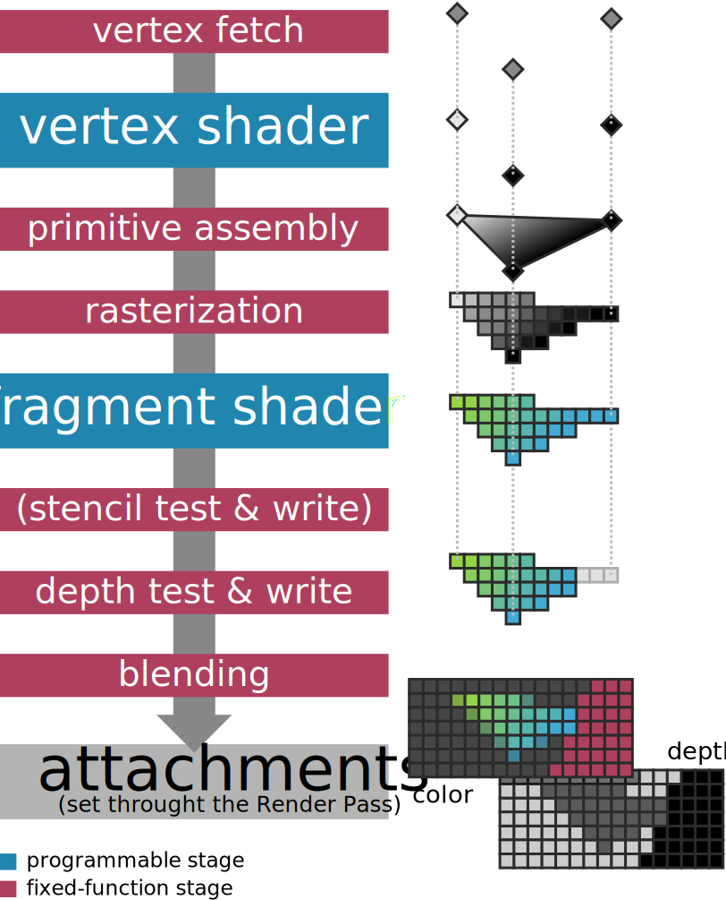

## Render Pipeline (doc for CPP version)

The pipeline is <strong>always the same</strong> (it is generally burnt into the physical architecture of the hardware), but we can configure it in many ways.

### Vertex pipeline state
Both the <strong>vertex fetch</strong> and <strong>vertex shader</strong> stages are configured through the <strong>vertex state</strong> structure, accessible at `pipelineDesc.vertex`

A shader is the combination of:
- A <strong>shader module</strong>, which contains the actual code of the shader.
- An <strong>entry point</strong>, which is the name of function in the shader module that must be called for each vertex
- An array of value assignments for the <strong>constants</strong> of the shader.

### Primitive pipeline state
The <strong>primitive state</strong> structure found at `pipelineDesc.primitive` configures the <strong>primitive assembly</strong>
and <strong>rasterization</strong> stages.

```cpp
// Each sequence of 3 vertices is considered as a triangle
pipelineDesc.primitive.topology = PrimitiveTopology::TriangleList;

// We'll see later how to specify the order in which vertices should be
// connected. When not specified, vertices are considered sequentially.
pipelineDesc.primitive.stripIndexFormat = IndexFormat::Undefined;

// The face orientation is defined by assuming that when looking
// from the front of the face, its corner vertices are enumerated
// in the counter-clockwise (CCW) order.
pipelineDesc.primitive.frontFace = FrontFace::CCW;

// But the face orientation does not matter much because we do not
// cull (i.e. "hide") the faces pointing away from us (which is often
// used for optimization).
pipelineDesc.primitive.cullMode = CullMode::None;
```

### Fragment Shader
Once a primitive have been turned into fragments, the <strong>fragment shader</strong> stage is invoked for each one of them.
This shader receives the interpolated values generated by the vertex shader, and must output on its turn the <strong>final color</strong> of the fragment.
The configuration is very similar to the configuration of the vertex shader.

### Stencil/Depth state
The <strong>depth test</strong> is used to discard fragments that are <strong>behind</strong> other fragments associated to the same pixel. Remember that a fragment is the projection of a given primitive on a given pixel,
so when primitives overlap each others, multiple fragments are emmited for the same pixel. Fragments have a `depth` information, which is used by the depth test.

The stencil test is another fragment discard mechanism, used to hide fragments based on previously rendered primitives.

### Blending 
The blending stage takes each fragment's color and "paints" it onto the target color attachment.

### Multi-sampling
I said previously that a fragment is the portion of a primitive that is projected onto a specific pixel.
Actually, we can split pixels into sub-elements, called <strong>samples</strong>, and the fragment is associated to a sample. The value of a pixel is computed by averaging its associated samples.

This mechanism is called multi-sampling and is used for anti-aliasing.

### Pipeline layout
The shaders might need to <strong>access input and output resources</strong> (buffers and/or textures). These resources are made available to the pipeline by configuring a memory <strong>layout</strong>. Our first example does not use any resource. 

### Vertex Attribute
```cpp
  wgpu::VertexAttribute vertexAttrib;
  vertexAttrib.shaderLocation = 0;
  vertexAttrib.format = wgpu::VertexFormat::Float32x2;
  vertexAttrib.offset = 0;
```
Vertex Attribute information is needed to construct `Vertex Buffer Layout`
- @location(0) in shader file
- format float32
- offset = 0
```cpp
  wgpu::VertexBufferLayout vertexBufferLayout;
  vertexBufferLayout.attributeCount = 1;
  vertexBufferLayout.attributes = &vertexAttrib; // need it here <---
  vertexBufferLayout.arrayStride = 2 * sizeof(float);
  vertexBufferLayout.stepMode = wgpu::VertexStepMode::Vertex;
```
### Vertex Buffer & Vertex Buffer Layout
- Vertex buffer layout will be pass to PipelineDescriptor
```cpp
  pipelineDesc.vertex.buffers = &vertexBufferLayout;
```
- Create Vertex buffer object in CPU
```cpp
  wgpu::Buffer vertexBuffer = device.createBuffer(bufferDesc);
```
- Move this Vertex buffer object from CPU to GPU buffer zone
```cpp
  queue.writeBuffer(vertexBuffer, 0, vertexData.data(), bufferDesc.size);
```
- Call function to render this vertex buffer from render encoder
```cpp
renderPass.setVertexBuffer(0, vertexBuffer, 0, vertexData.size() * sizeof(float));
```


